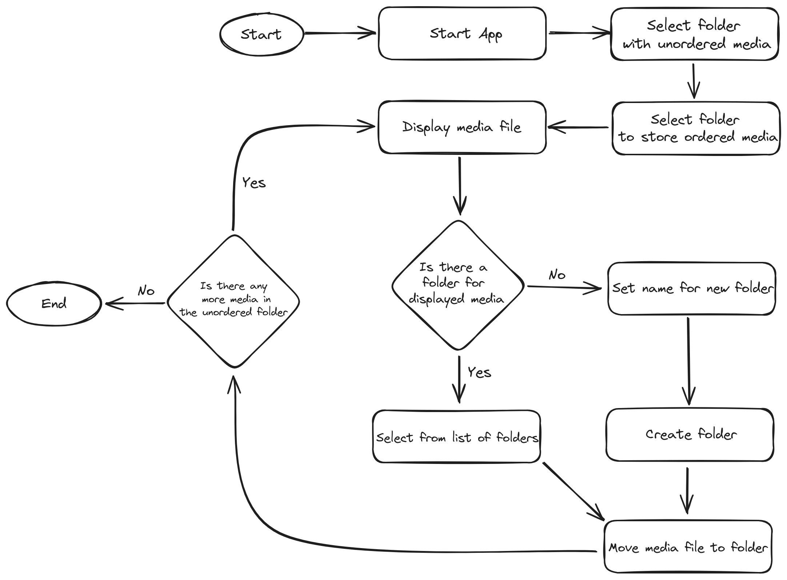

# MediaHarmonizer

MediaHarmonizer is a web-based application designed to streamline the organization of media files on your computer. It simplifies the process of creating folders, selecting existing folders, and moving unorganized media to designated folders within a target directory.

Here's a small diagram that illustrates the process

